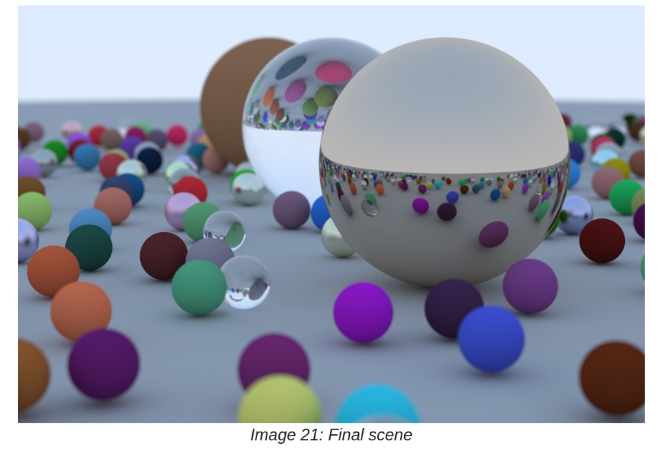
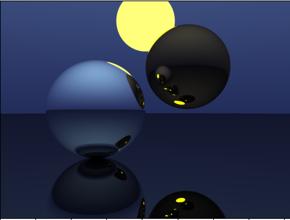

# Assignment 2 - First Ray Tracer

> "A powerful rendering technique!"

## Implementation Logistics

- You may use whatever operating system, IDE, or tools for completing this lab/assignment.
	- However, my instructions will usually be using the command-line, and that is what I will most easily be able to assist you with.
- You may use whatever programming language that you like
	- Plan on committing to this language for the duration of the semester. Any mainstream language should be fine--consult the instructor otherwise if you are not sure.
- In the future there may be restrictions, so please review the logistics each time.

**For this Lab/Assignment**: You will be working on your own laptop/desktop machine.

# Resources to help

- https://raytracing.github.io/books/RayTracingInOneWeekend.html
  	- Peter Shirley book (Ray Tracing in a Weekend)
	- This is your guide for completing the assignment today
- https://www.scratchapixel.com/
	- Volume 1 has many helpful resources on 3D Rendering.

# Description

For this homework your goal is to create your first functioning ray tracer! Yes, whether or not you believe it, you can build a ray tracer in just a few short hours. Our guide will be the [Ray Tracing in One Weekend Text](https://raytracing.github.io/books/RayTracingInOneWeekend.html). The first half of the text you will generate an image with several spheres on it. Slowly, you will then add properties to these spheres (materials), and control how the rays bounce, refract, and move. While you are welcome to not use the Shirley text as a guide, I find it a good and inspirational text for this course to get something working and then we will refine and add features as we go.

# Assignment Strategy

Build iteratively.

You're going to notice while following along the Shirley that he very slowly iterates on his ray tracer. This is an important skill for us to also learn as engineers. Add a feature, test, check if our expectations of that test are met, and then proceed forward, or otherwise fix the bugs. Included in the image above are some sample iterations of my ray tracer that I have built while following along the text.

I recommend that each time you add a feature, you do a [git add](https://git-scm.com/docs/git-add), [git commit -m "some message"](https://git-scm.com/docs/git-commit), and a [git push](https://git-scm.com/docs/git-push) after. That will help you track your progress as well (In industry, having 1 large commit is generally something that is not acceptable practice, so why not practice the habit now?)

## Tasks

This assignment will be a little more self-guided in a sense, in that the expectation is you will use the [Ray Tracing in a Weekend](https://raytracing.github.io/books/RayTracingInOneWeekend.html) book by Peter Shirley to get you up and running. The book is roughly 46 pages of reading with code samples included. You are welcome to implement the project in whichever language you like, though you should provide your own abstractions. For example, even those working in C or C++ may want to wrap some of the functions into classes or a different abstraction. That is okay and encouraged!

### Concrete Requirements

To make a few concrete requirements, your ray tracer should include the following.

- [ ] - At least 3 spheres
	- Comment in your code 'Sphere Requirement'
- [ ] - At least 2 materials (e.g. diffuse sphere, glass, metal, opaque color, etc.)
	- Comment in your code 'Materials Requirement'
- [ ] - Support reflection (e.g. a metal sphere would show this property)
	- Comment in your code 'Reflection Requirement'
- [ ] - A Camera class such that you can position the camera in different orientations
	- Comment in your code 'Camera Requirement'
- [ ] - The ability to output an image called 'output.ppm'
	- Comment in your code 'PPM Requirement'
- [ ] - Implement gamma correction. You can use the trick Shirley uses in his book.
	- Comment in your code 'Gamma Requirement'

Note: That for each of the requirements, you should put a comment (in whatever syntax that is) with the text below so we can easily see that part of your implementation. This will help me give feedback. For instance, I might want to comment if I think you can add some abstraction to your spheres (e.g. An 'object manaager' class to manage all of your spheres).

## Creativity - Spirit of the assignment.

In the course I want to encourage some creativity as opposed to rigid guidelines. To the right is an example of my interpretation of the assignment as a sample. I think it can be interesting to change some colors and 'create atmosphere'. We will continue to build on our ray tracers, but you should experiment and have fun--learning is suppose to be fun!

## How to run your program

Your solution will include a document called [run.md](./run.md) that provides instructions on how to compile/interpret/execute/etc. your program. You should minimize the number of dependencies needed. Please edit the [run.md](./run.md) so that I know how to run your software. The goal again is to be able to easily run your raytracer and generate an output.ppm image showcasing your scene.

**Note**: It is very likely your instructions will be the same each time, but please provide them.

# Submission/Deliverables

### Submission

- Commit all of your files to github, including any additional files you create.
- Do not commit any binary files unless told to do so.
- Do not commit any 'data' files generated when executing a binary.

### Deliverables

1. Upload an image to the repository called [output.ppm](./output.ppm) that shows an example of what your ray tracer generated.
2. Upload all of your source code for your ray tracer that satisfy the 'Concrete Requirements' Section.

# Going Further

What is that, you finished Early? Did you enjoy this assignment? Here are some (optional) ways to further this assignment.

- Start reading the second book--that is where we will go shortly. We'll have some more work to do before then, but we'll eventually move on to the second book if you want to peek ahead.

# F.A.Q. (Instructor Anticipated Questions)

1. Question: Can I add more?
2. Answer: Sure, but we'll be working from the second book.

# Found a bug?

If you found a mistake (big or small, including spelling mistakes) in this lab, kindly send me an e-mail. It is not seen as nitpicky, but appreciated! (Or rather, future generations of students will appreciate it!)

- Fun fact: The famous computer scientist Donald Knuth would pay folks one $2.56 for errors in his published works. [[source](https://en.wikipedia.org/wiki/Knuth_reward_check)]
- Unfortunately, there is no monetary reward in this course :)
