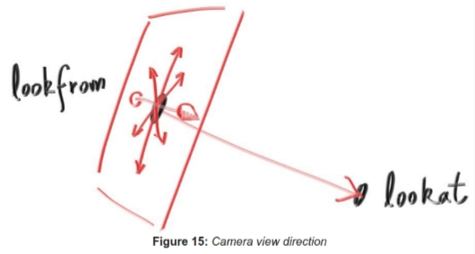
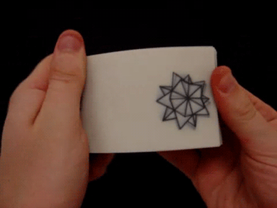

# Assignment 3 - Camera

> "Rendering multiple frames!"

## Implementation Logistics

- You may use whatever operating system, IDE, or tools for completing this lab/assignment.
	- However, my instructions will usually be using the command-line, and that is what I will most easily be able to assist you with.
- You may use whatever programming language that you like
	- Plan on committing to this language for the duration of the semester. Any mainstream language should be fine--consult the instructor otherwise if you are not sure.
- In the future there may be restrictions, so please review the logistics each time.

**For this Lab/Assignment**: You will be working on your own laptop/desktop machine.

# Resources to help

- https://raytracing.github.io/books/RayTracingInOneWeekend.html
  	- Peter Shirley book (Ray Tracing in a Weekend)
	- This is your guide for completing the assignment today
- https://www.scratchapixel.com/
	- Volume 1 has many helpful resources on 3D Rendering.

# Description

For this homework your goal is to continue building on top of your ray tracer this time focusing on the camera. For this assignment your goal is going to be to capture and output a series of ppm images. Of course, it will be up to you to choose which 5 positions to capture your scene from. Some folks may want a series of images to mimic a flip book (see below), or otherwise to capture a few views of your scene.

(imgage credits: https://nycdoe-cs4all.github.io/images/la/4_1/flip_book.gif)

# Assignment Strategy

As always, it's worthwhile to build iteratively. If a portion of your previous assignment is not working--it will be worth going back to try to fix those features. Please reach out if something is not possibly working. Today's assignment will finish most of the features from the first Shirley book.

## Tasks

For this assignment, you are going to implement a few new features into your ray tracer related to the camera and how it processes images. The techniques presented will help you render higher quality images.

### Concrete Requirements

To make a few concrete requirements, your ray tracer will implement the following features.

- [ ] - A positionable camera
	- Comment in your code 'Camera Requirement'
- [ ] - Depth of Field (DoF) (Or as Shirley calls it, Defocus Blur)
	- Comment in your code 'Depth of Field Requirement'
	- You should demonstrate this by creating multiple objects in your scene (some in the foreground and some in the background)
- [ ] - Antialiasing using the multi-sampling technique in Shirley
	- Comment in your code 'Antialiasing Requirement'
- [ ] - When running your program, it should automatically generate '5' images labeled: output1.ppm,output2.ppm,output3.ppm,output4.ppm,output5.ppm
	- Each of these 5 images should be at a different position. That is, the camera should be looking at your science from a different origin, or otherwise a different target.
	- Comment in your code 'View Requirement'

Note: That for each of the requirements, you should put a comment (in whatever syntax that is) with the text below so I can easily see part of your implementation. This will help me give feedback. 

## Creativity - Spirit of the assignment.

**Repeat from last assignment--but here's a reminder**

*In the course I want to encourage some creativity as opposed to rigid guidelines. To the right is an example of my interpretation of the assignment as a sample. I think it can be interesting to change some colors and 'create atmosphere'. We will continue to build on our ray tracers, but you should experiment and have fun--learning is suppose to be fun!*

## How to run your program

Your solution will include a document called [run.md](./run.md) that provides instructions on how to compile/interpret/execute/etc. your program. You should minimize the number of dependencies needed. Please edit the [run.md](./run.md) so that I know how to run your software. The goal again is to be able to easily run your raytracer and generate an output.ppm image showcasing your scene.

**Note**: It is very likely your instructions will be the same each time, but please provide them.

# Submission/Deliverables

### Submission

- Commit all of your files to github, including any additional files you create.
- Do not commit any binary files unless told to do so.
- Do not commit any 'data' files generated when executing a binary.

### Deliverables

1. Upload the output images (output1.ppm, output2.ppm, etc.) that shows an example of what your ray tracer generated.
2. Upload all of your source code for your ray tracer that satisfy the 'Concrete Requirements' Section.

# Going Further

What is that, you finished Early? Did you enjoy this assignment? Here are some (optional) ways to further this assignment.

- Start reading the second book--that is where we will go shortly. We'll have some more work to do before then, but we'll eventually move on to the second book if you want to peek ahead.

# F.A.Q. (Instructor Anticipated Questions)

1. Question: Can I add more?
2. Answer: Sure, but we'll be working from the second book.

# Found a bug?

If you found a mistake (big or small, including spelling mistakes) in this lab, kindly send me an e-mail. It is not seen as nitpicky, but appreciated! (Or rather, future generations of students will appreciate it!)

- Fun fact: The famous computer scientist Donald Knuth would pay folks one $2.56 for errors in his published works. [[source](https://en.wikipedia.org/wiki/Knuth_reward_check)]
- Unfortunately, there is no monetary reward in this course :)
