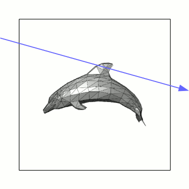

# Assignment 4 - Triangles

> "There is more to life than just spheres"

## Implementation Logistics

- You may use whatever operating system, IDE, or tools for completing this lab/assignment.
	- However, my instructions will usually be using the command-line, and that is what I will most easily be able to assist you with.
- You may use whatever programming language that you like
	- Plan on committing to this language for the duration of the semester. Any mainstream language should be fine--consult the instructor otherwise if you are not sure.
- In the future there may be restrictions, so please review the logistics each time.

**For this Lab/Assignment**: You will be working on your own laptop/desktop machine.

# Resources to help

- https://www.scratchapixel.com/lessons/3d-basic-rendering/ray-tracing-polygon-mesh/polygon-to-triangle-mesh
  	- Scratch Pixel Tutorial
	- Nice tutorial on polygon mesh processing
- http://paulbourke.net/dataformats/obj/minobj.html
	- Object file format

# Description

For this homework your goal is to continue building on top of your ray tracer this time rendering triangle meshes. Your goal will be to load a .obj model format. I would recommend this [scratch pixel](https://www.scratchapixel.com/lessons/3d-basic-rendering/ray-tracing-rendering-a-triangle/why-are-triangles-useful) website for rendering triangle meshes. It may be useful to walk through this code, or setup the ability to render one triangle first within your codebase, prior to working with the OBJ model format.

# Assignment Strategy

As always, it's worthwhile to build iteratively. If a portion of your previous assignment is not working--it will be worth going back to try to fix those features. Please reach out if something is not otherwise working and you need help.

## Tasks

For this assignment, you are going to implement a few new features into your ray tracer related to the camera and how it processes images. The techniques presented will help you render higher quality images.

### Concrete Requirements

To make a few concrete requirements, your ray tracer will implement the following features.

- [ ] - Ability to load and render .obj file (Some samples are provided in the common/objects folder)
	- Comment in your code 'OBJ requirement'
	- You need not render textured models.
   	- You can assume models with be triangulated (i.e. you do not have to support loading of quad-based models). 
	- You can hard code which model to load -- otherwise provide instructions in your run.md for how to load a model (e.g. You may support loading models as command line arguments `./prog ./path/to/model.obj`)
	- Performance does not matter on the time to render your models.
- [ ] - Output
	- Output and upload to your repository an output.ppm image of what your ray tracer produced. (You can upload more images if you like, but at least one)
	- For example, it's recommend that you can render a 'bunny' (see common/objects folder for bunny_centered.obj). You can choose whatever material or solid color you like.

There have been a few other tasks from in-class activities that you can **optionally** incorporate.

- [ ] - (Optional) Motion Blur
	- Comment in your code 'Motion Blur Requirement'
	- You can demonstrate this by moving the object
	
Note: That for each of the requirements, you should put a comment (in whatever syntax that is) with the text below so I can easily see part of your implementation. This will help me give feedback. 

### OBJ Format

The models that you will be loading are in the [.obj format](https://en.wikipedia.org/wiki/Wavefront_.obj_file). This format stores the vertices, normals, and faces of an object (and potentially other information as well). The easiest way to become familiar with the OBJ file format is to investigate a 3D Cube model. 

### Parsing the file

(For this assignment, ignore the .mtl materials files)
```
mtllib cube.mtl
o Cube1
#8 vertices, 12 faces
v -1.00000000 -1.00000000 -1.00000000
v -1.00000000 -1.00000000 1.00000000
v -1.00000000 1.00000000 -1.00000000
v -1.00000000 1.00000000 1.00000000
v 1.00000000 -1.00000000 -1.00000000
v 1.00000000 -1.00000000 1.00000000
v 1.00000000 1.00000000 -1.00000000
v 1.00000000 1.00000000 1.00000000
vn -0.57735027 -0.57735027 -0.57735027
vn -0.57735027 -0.57735027 0.57735027
vn -0.57735027 0.57735027 -0.57735027
vn -0.57735027 0.57735027 0.57735027
vn 0.57735027 -0.57735027 -0.57735027
vn 0.57735027 -0.57735027 0.57735027
vn 0.57735027 0.57735027 -0.57735027
vn 0.57735027 0.57735027 0.57735027
g Cube1_default
usemtl default
s 1
f 1//1 5//5 2//2
f 2//2 3//3 1//1
f 2//2 5//5 6//6
f 2//2 8//8 4//4
f 3//3 5//5 1//1
f 3//3 8//8 7//7
f 4//4 3//3 2//2
f 4//4 8//8 3//3
f 5//5 8//8 6//6
f 6//6 8//8 2//2
f 7//7 5//5 3//3
f 7//7 8//8 5//5
```

For this file, the encoding is the following:
* Lines that start with *v* stands for a 'vertex'.
	* A vertex has an x,y,z coordinate that follows.
* Lines that start with *vn* stands for a 'vertex normal'.
	* A vertex normal is a normalized directional vector(from 0,0,0 to its location)
* Lines that start with *f* stands for 'face'.
	* A face can consist of any number of vertices. 
	* The first number is the index of the vertex we are using. 
	* The second number after the double slashes (//) is the vertex normal index.
* The other fields (that start with o, s, or the .mtl file) can be ignored for this assignment.
* Note that there are no '0' values in the list. This means .obj is 1's based. In most languages we count from 0, so think about what this means when parsing!

## Creativity - Spirit of the assignment.

**Repeat from last assignment--but here's a reminder**

*In the course I want to encourage some creativity as opposed to rigid guidelines. To the right is an example of my interpretation of the assignment as a sample. I think it can be interesting to change some colors and 'create atmosphere'. We will continue to build on our ray tracers, but you should experiment and have fun--learning is suppose to be fun!*

## How to run your program

Your solution will include a document called [run.md](./run.md) that provides instructions on how to compile/interpret/execute/etc. your program. You should minimize the number of dependencies needed. Please edit the [run.md](./run.md) so that I know how to run your software. The goal again is to be able to easily run your raytracer and generate an output.ppm image showcasing your scene.

**Note**: It is very likely your instructions will be the same each time, but please provide them.

# Submission/Deliverables

### Submission

- Commit all of your files to github, including any additional files you create.
- Do not commit any binary files unless told to do so.
- Do not commit any 'data' files generated when executing a binary.

### Deliverables

1. Upload the output images (output.ppm,) that shows an example of what your ray tracer generated.
2. Upload all of your source code for your ray tracer that satisfy the 'Concrete Requirements' Section.

# Going Further

What is that, you finished Early? Did you enjoy this assignment? Here are some (optional) ways to further this assignment.

- Start reading the third book--that is where we will go for our final weeks.

# F.A.Q. (Instructor Anticipated Questions)

1. Question: Can I add more?
2. Answer: Sure, you can try to add textures if you like.

# Found a bug?

If you found a mistake (big or small, including spelling mistakes) in this lab, kindly send me an e-mail. It is not seen as nitpicky, but appreciated! (Or rather, future generations of students will appreciate it!)

- Fun fact: The famous computer scientist Donald Knuth would pay folks one $2.56 for errors in his published works. [[source](https://en.wikipedia.org/wiki/Knuth_reward_check)]
- Unfortunately, there is no monetary reward in this course :)
