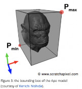

# Assignment 5 - Speeding things up

> "Performance"

## Implementation Logistics

- You may use whatever operating system, IDE, or tools for completing this lab/assignment.
	- However, my instructions will usually be using the command-line, and that is what I will most easily be able to assist you with.
- You may use whatever programming language that you like
	- Plan on committing to this language for the duration of the semester. Any mainstream language should be fine--consult the instructor otherwise if you are not sure.
- In the future there may be restrictions, so please review the logistics each time.

**For this Lab/Assignment**: You will be working on your own laptop/desktop machine.

# Resources to help

- https://raytracing.github.io/books/RayTracingTheNextWeek.html#boundingvolumehierarchies
	- Shirley's 2nd text on Bounding Volume Hiearchies

# Description

For this homework your goal is to continue building on top of your ray tracer this time adding an optimization to speed up your rendering times. Your goal will be to add a bounding volume to your objects, such that you can reduce the number of rays that must be tested for intersection.

# Assignment Strategy

As always, it's worthwhile to build iteratively. If a portion of your previous assignment is not working--it will be worth going back to try to fix those features. Please reach out if something is not otherwise working and you need help.

## Tasks

For this assignment, you are going to implement a bounding box around each of your objects. This means that every object should have a bounding box. In your main loop of your application, you first should do a test if a ray intersects with the bounding box, and then proceed to performing another intersection test with your objects.

I am not requiring you to implement a full bounding volume hiearchy, or several different types of bounding shapes (e.g. sphere, capsule, convex hull, etc.), though those may be good things to try if you finish the assignment early.

### Concrete Requirements

To make a few concrete requirements, your ray tracer will implement the following features.

- [ ] -Ability to create a bounding box around an object. 
	- Comment in your code 'Bounding Volume requirement'
	- Performance does not matter on the time to render your models.
- [ ] - Output intersections 
	- For this assignment, I would also like you to output the total number of rays cast, the number of intersections with the bounding volume, and the total intersections with actual objects.
	- e.g. output after your program has run
	- ```
		Rays Cast: XXXXXXXX
		Bounding Volume Intersections: XXXXXXXX
		Successful Object Intersections: XXXXX
	  ```
	
Note: That for each of the requirements, you should put a comment (in whatever syntax that is) with the text below so I can easily see part of your implementation. This will help me give feedback. 

## Creativity - Spirit of the assignment.

**Repeat from last assignment--but here's a reminder**

*In the course I want to encourage some creativity as opposed to rigid guidelines. To the right is an example of my interpretation of the assignment as a sample. I think it can be interesting to change some colors and 'create atmosphere'. We will continue to build on our ray tracers, but you should experiment and have fun--learning is suppose to be fun!*

## How to run your program

Your solution will include a document called [run.md](./run.md) that provides instructions on how to compile/interpret/execute/etc. your program. You should minimize the number of dependencies needed. Please edit the [run.md](./run.md) so that I know how to run your software. The goal again is to be able to easily run your raytracer and generate an output.ppm image showcasing your scene.

**Note**: It is very likely your instructions will be the same each time, but please provide them.

# Submission/Deliverables

### Submission

- Commit all of your files to github, including any additional files you create.
- Do not commit any binary files unless told to do so.
- Do not commit any 'data' files generated when executing a binary.

### Deliverables

1. Upload the output images (output.ppm) that shows an example of what your ray tracer generated.
2. Upload all of your source code for your ray tracer that satisfy the 'Concrete Requirements' Section.

# Going Further

What is that, you finished Early? Did you enjoy this assignment? Here are some (optional) ways to further this assignment.

- Start reading the third book--that is where we will go for our final weeks.

# F.A.Q. (Instructor Anticipated Questions)

1. Question: Can I add more?
2. Answer: Sure, you can try to add different types of bounding volumes or a complete BVH hiearchy.

# Found a bug?

If you found a mistake (big or small, including spelling mistakes) in this lab, kindly send me an e-mail. It is not seen as nitpicky, but appreciated! (Or rather, future generations of students will appreciate it!)

- Fun fact: The famous computer scientist Donald Knuth would pay folks one $2.56 for errors in his published works. [[source](https://en.wikipedia.org/wiki/Knuth_reward_check)]
- Unfortunately, there is no monetary reward in this course :)
