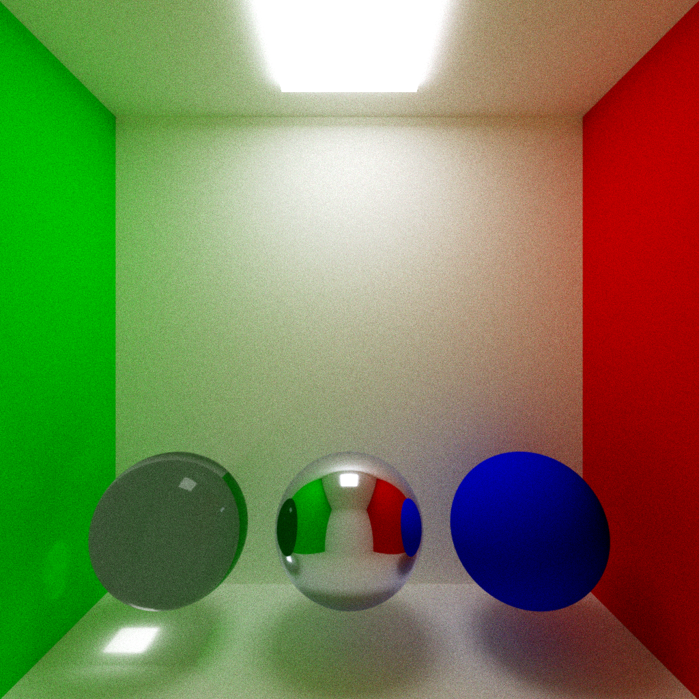

# Ray Tracing: The Next Week in WebGPU

This is a WebGPU and TypeScript-based raytracer, inspired by (and largely following) Peter Shirley's _[Ray Tracing in One Weekend](https://raytracing.github.io/books/RayTracingInOneWeekend.html)_ and _[Ray Tracing: The Next Week](https://raytracing.github.io/books/RayTracingTheNextWeek.html)_, v4.0.0-alpha.1. Features include:

- A compute-shader based raytracer
- Multiple material types, including diffuse, metal, dielectric (glass), emissive, and volumetrics
- Support for spheres and OBJ (Wavefront) meshes
- Automatic AABB-based BVH calculations and traversal
- Tunable sampling and ray depth, with frametime and ray statistics
- A positionable camera with depth-of-field effects
- Multiple scenes demonstrating these features
- A download function for your favorite frames ❤️

Many thanks to the people who've helped me throughout this project:
- Professor Mike Shah, for their lectures and debugging help
- [amaiorano's implementation](https://github.com/amaiorano/raytracing-in-one-weekend-webgpu) of the _Ray Tracing in One Weekend in WebGPU_ v3.2.3, which served as a useful guide for setting up my WebGPU environment (though I opted not to use it for my core features) 
- greggman, in particular for providing and assisting with [webgpu-utils](https://github.com/greggman/webgpu-utils)
- [webgpufundamentals.org](https://webgpufundamentals.org/)
- Brandon Jones's [toji.dev](https://toji.dev)
- The people of the WebGPU Matrix server

## Building and developing

If you'd like to build this locally rather than using the hosted version for development purposes, please use the following instructions:

1. Update your GPU drivers. For Windows users, DDU + fresh install is recommended, but probably not required.
2. **Download the latest stable version of Google Chrome.** Chrome 113 (May 10, 2023) is *required*, and Chrome 117 or newer is *highly recommended.* Chrome Canary (nightly) can also be more stable on some systems. WebGPU support in other browsers (even other Chromium distributions) is generally poor, and not recommended.
3. Ensure you have Node.js 20 installed.
4. In the root directory, run `npm install && npm start`.
5. In Chrome, navigate to http://localhost:1234/. You should see a rendered scene.

Please note that both the WebGPU spec and its various implementations (namely Dawn) are still in active development; you may experience bugs or performance issues.

## Design

- As with most shader languages, WGSL does not support recursion or inheritance. As such, materials are differentiated with a manual struct field, with different geometry types accessed by index in their respective `hit()` functions.
- Random number generation is handled by TypeScript and passed to WebGPU, as WGSL contains no facilities for RNG.
- I've opted not to support quadrilaterals, instead adding support for arbitrary triangle meshes
- There is currently no support for .MTL files or textures. This may change in the future.
- There is no support for animations. I don't plan to add this.