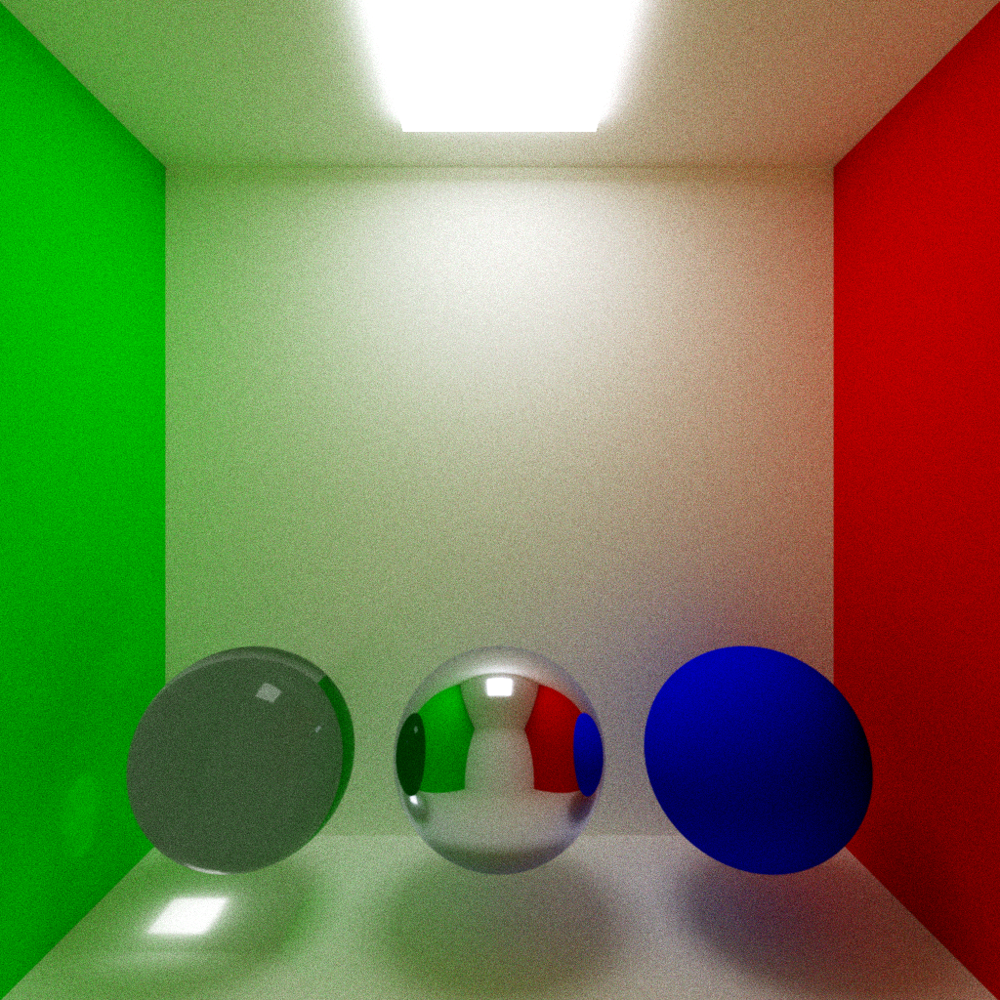
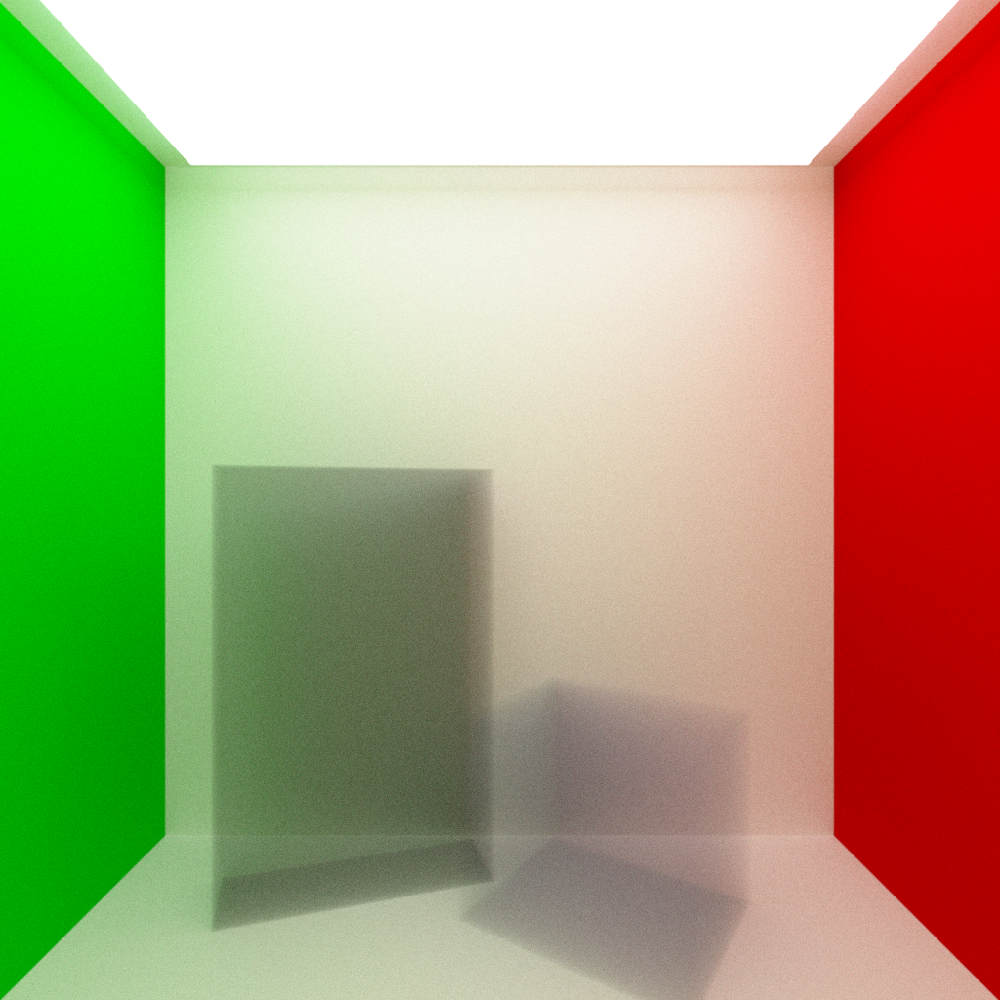
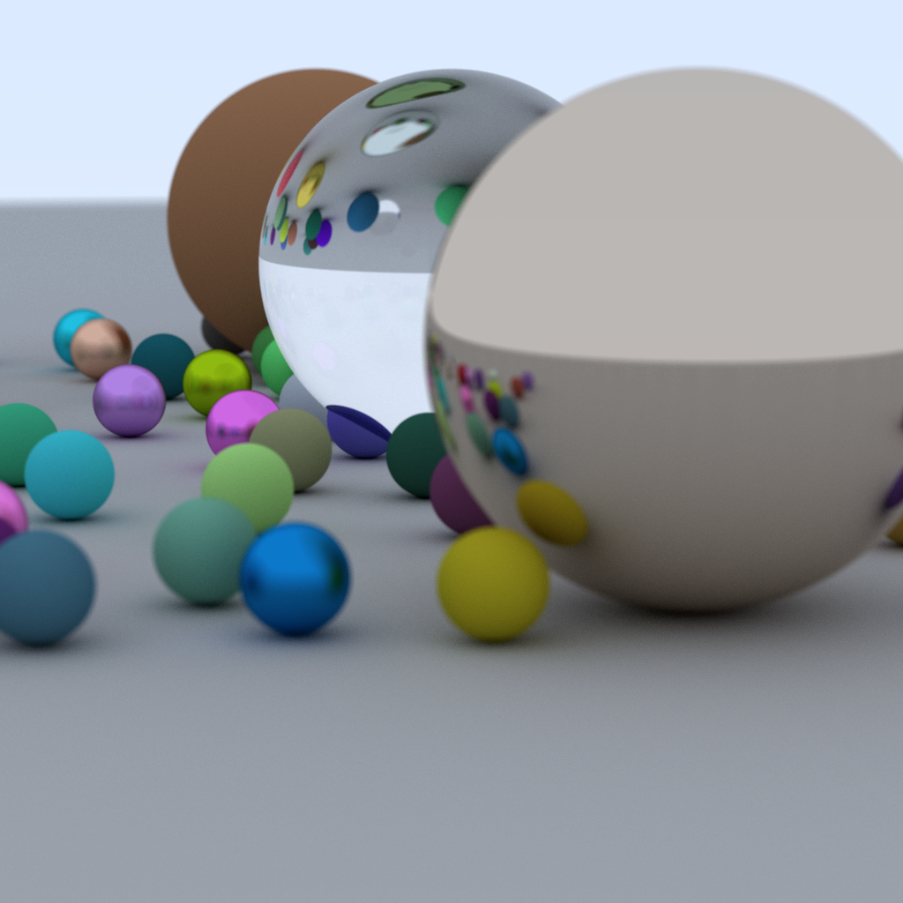

*TODO*: Please edit the following information in your final project

## [Link to my video](https://youtu.be/q7dAR1EzN04)

## Screenshots

* Name: Jonathan Edelman
* How many hours did it take you to complete this final project?
  * Approximately 45, though this is fairly rough since lots of this was optimizations that occurred between assignments 5 and the final.
* Did you collaborate or share ideas with any other students/TAs/Professors?
  * No.
* Did you use any external resources?
  * Shirley's Ray Tracing: The Next Week served as the primary reference
  * I talked with some people on the WebGPU Matrix server regarding optimization and debugging of aspects of my compute shader.
* (Optional) What was the most interesting part of the Final Assignment? How could the instructor improve the final project?
  * Tweaking the performance to make it work reasonably well. No suggestions on improvements.

### Rubric

<table>
  <tbody>
    <tr>
      <th>Points</th>
      <th align="center">Description</th>
    </tr>
    <tr>
      <td>(33.3%) Project Completion</td>
     <td align="left"><ul><li>Does the project compile and run.</li><li>Is it polished without any bugs (No weird visual artifacts).</li><li>Did you make a video?</li><li>Did you add a screenshot of your project to the repository?</li></ul></td>
    </tr>
    <tr>
      <td>(33.3%) Technical</td>
      <td align="left"><ul><li>Was the implementation of the project challenging?</li><li>Even if you followed a tutoral, it should not be trivial, and have some personal touch to it.</li><li>Did you have to organize/process a sufficient amount of data?</li><li>Was it clear you consulted some outside resources that go above and beyond the scope of this class</li></ul></td>
    </tr>
    <tr>
      <td>(33.4%) Creativity</td>
      <td align="left"><ul><li>How visually appealing is the scene?<ul><li>Note: There should be some 'wow' factor--instructors discretion is used here.</li></ul></li><li>How original is the project<ul><li>Again, did you enhance a tutorial and do something unique or just go by the book?</li></ul></li></ul></td>
    </tr>
  </tbody>
</table>
